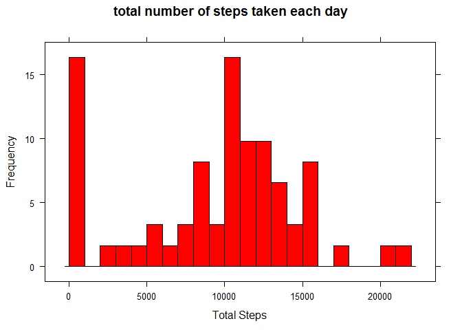
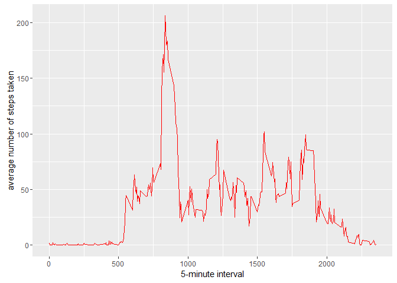
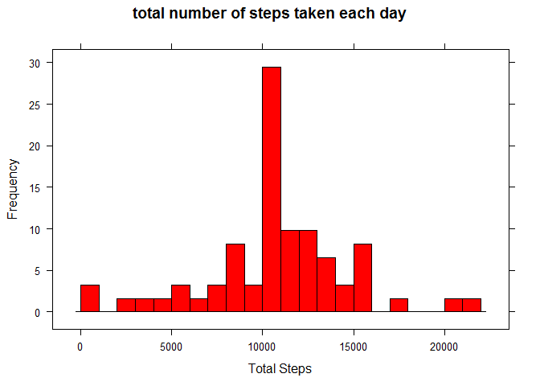
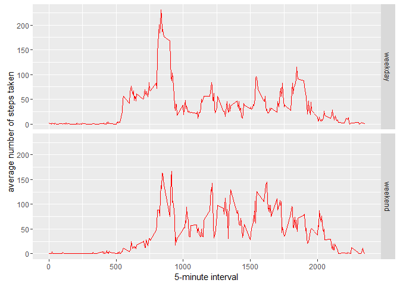

# Reproducible Research Week 2 Course Project 1


## Loading and preprocessing the data

Unzip data to obtain a csv file and read the csv file.


```r
unzip("activity.zip")
activity <- read.csv("activity.csv", header = TRUE, colClasses = c("numeric","character","numeric"), na = "NA")
```
## What is mean total number of steps taken per day?


```r
library(lattice)
stepsdata <- aggregate(activity$steps, by =list(activity$date), FUN = sum, na.rm =TRUE)
names(stepsdata) <- c("date", "total.steps")
histogram(stepsdata$total.steps,col = 'red', xlab = "Total Steps",ylab = "Frequency", main ="total number of steps taken each day", breaks =  20)
```

<!-- -->

```r
beforestepsmean <- mean(stepsdata$total.steps, na.rm = TRUE)
beforestepsmedian <- median(stepsdata$total.steps, na.rm = TRUE)
beforestepsmean
```

```
## [1] 9354.23
```

```r
beforestepsmedian
```

```
## [1] 10395
```
## What is the average daily activity pattern?

```r
library(ggplot2)
```

```
## Warning: package 'ggplot2' was built under R version 3.2.5
```

```r
intervaldata <- aggregate(x= list(steps = activity$steps), by =list(interval = activity$interval), FUN = mean, na.rm = TRUE)
ggplot(data=intervaldata, aes(x=interval, y=steps)) +
    geom_line(col= "red") +
    xlab("5-minute interval") +
    ylab("average number of steps taken")
```

<!-- -->

On average across all the days in the dataset, the 5-minute interval contains the maximum number of steps?

```r
intervaldata[which.max(intervaldata$steps),]
```

```
##     interval    steps
## 104      835 206.1698
```

## Imputing missing values

How many days have missing values?

```r
missingdata <- sum(is.na(activity$steps))
```

Fill the missing values with the mean value

```r
print(paste("There are", missingdata, "missing data points."))
```

```
## [1] "There are 2304 missing data points."
```

```r
value.fill <- function(steps, interval) {
    fillvalue <- NA
    if (!is.na(steps))
        fillvalue <- c(steps)
    else
        fillvalue <- (intervaldata[intervaldata$interval==interval, "steps"])
    return(fillvalue)
}
datana <- activity
datana$steps <- mapply(value.fill, datana$steps, datana$interval)
```
Create a histogram to show total number of steps taken each day and calculate the mean and median total number of steps.


```r
library(lattice)
stepsdata <- aggregate(datana$steps, by =list(datana$date), FUN = sum, na.rm =TRUE)
names(stepsdata) <- c("date", "total.steps")
histogram(stepsdata$total.steps,col = 'red', xlab = "Total Steps",ylab = "Frequency", main ="total number of steps taken each day", breaks =  20)
```

<!-- -->
## Are there differences in activity patterns between weekdays and weekends?

Using the above dataset to find the day of the week for each measurement

```r
weekday.or.weekend <- function(date) {
    day <- weekdays(date)
    if (day %in% c("Monday", "Tuesday", "Wednesday", "Thursday", "Friday"))
        return("weekday")
    else if (day %in% c("Saturday", "Sunday"))
        return("weekend")
    else
        stop("invalid date")
}
datana$date <- as.Date(datana$date)
datana$day <- sapply(datana$date, FUN=weekday.or.weekend)
```

Making a plot for calculating average number of steps taken
on weekdays and weekends.

```r
averages <- aggregate(steps ~ interval + day, data=datana, mean)
ggplot(data=averages, aes(x=interval, y=steps)) +
    geom_line(col= "red") +facet_grid(day ~ .) +
    xlab("5-minute interval") +
    ylab("average number of steps taken")
```

<!-- -->
